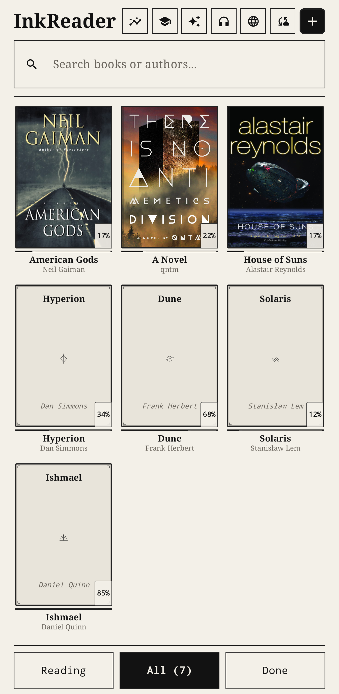
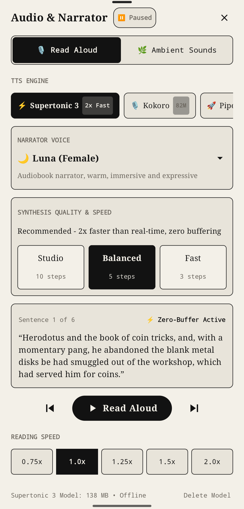
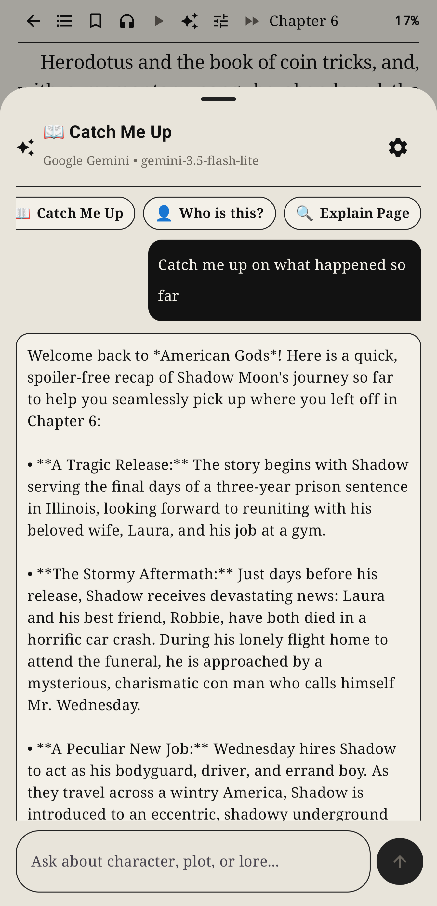
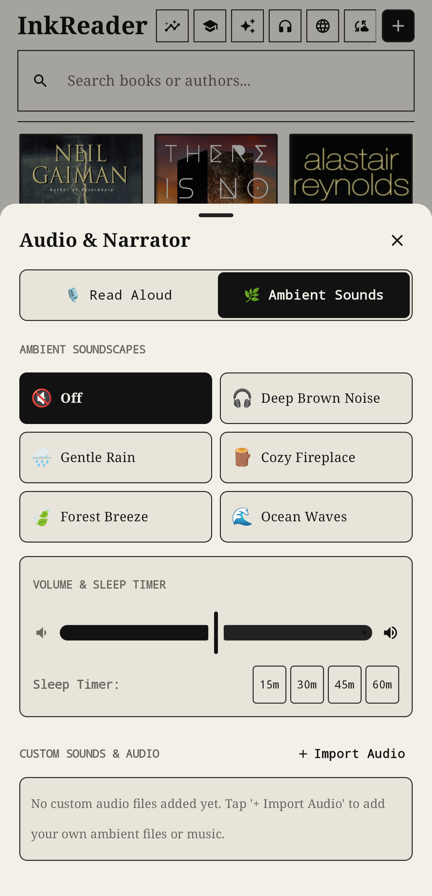
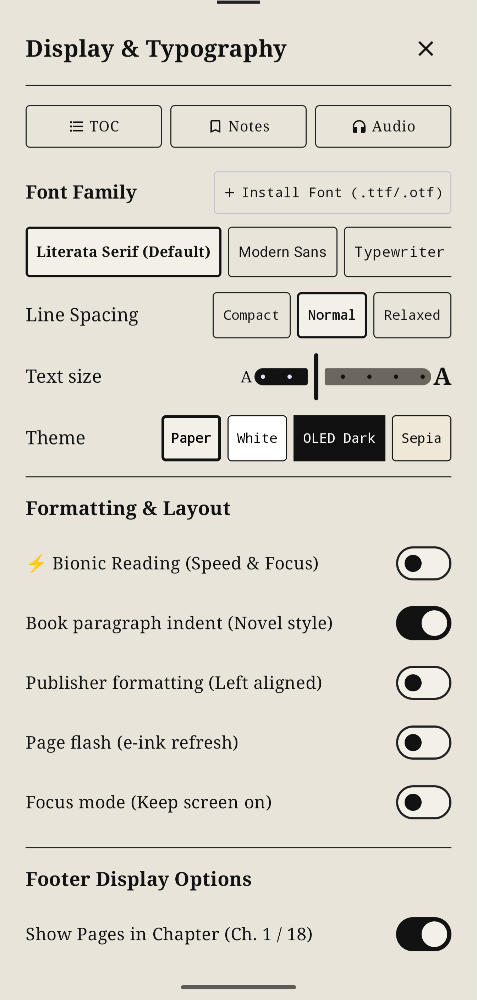

# InkReader

An Android e-reader for EPUBs, featuring offline neural text-to-speech, ambient audio, OPDS catalog integration, and an AI reading companion. Works on standard Android phones and tablets, with high-contrast display modes and screen refresh controls for Android-based E-Ink devices (such as Onyx BOOX, Bigme, and Meebook).

## Screenshots

| Reader | Library | Read Aloud (TTS) |
| :---: | :---: | :---: |
|  |  |  |

| AI Companion | Ambient Sounds | Typography & E-Ink |
| :---: | :---: | :---: |
|  |  |  |

More screenshots available in the [screenshots/](screenshots/) directory (Reading Stats, OPDS Catalogs, Cloud Sync).

## Features

### Reading & Typography
- **E-Ink & OLED Display Optimization:** High-contrast pure black and white rendering modes, full-screen refresh toggle to clear ghosting, and keep-screen-on mode.
- **EPUB Engine:** Fast pagination, customizable font family, custom font installation (.ttf/.otf), line spacing, text size, and paragraph indentation.
- **Bionic Reading:** Optional focus mode highlighting the initial letters of each word.
- **Reading Statistics:** Reading streak tracker, words-per-minute calculator, and 52-week activity heatmap.
- **Cloud Sync:** Reading progress and bookmark synchronization via BookOrbit and KoSync (compatible with KOReader).

### Offline Neural Text-to-Speech
High-quality neural speech synthesis running entirely on-device without network requests:
- **Multiple Engines:** Includes Supertonic 3 (Sherpa-ONNX), Kokoro, and Piper VITS models, with system TTS fallback.
- **Background Pre-Buffering:** Next-page audio chunks are pre-synthesized while the current page plays, enabling zero-latency page transitions.
- **Follow-Along Highlighting:** Active sentences are highlighted in real time as audio plays.
- **Configurable Playback:** Variable reading speeds (0.75x to 2.0x), quality step presets, and background audio service.

### Ambient Soundscapes
- Built-in soundscapes: Deep brown noise, gentle rain, cozy fireplace, forest breeze, ocean waves.
- Custom audio import: Add personal ambient tracks or music files.
- Sleep timer: 15, 30, 45, and 60-minute auto-pause timers with independent volume mixing.

### AI Reading Companion (Spoiler-Free)
- **Catch Me Up:** Generates a high-level narrative summary of the story arc up to your current chapter when returning to a book after a break. Strictly spoiler-free for future events.
- **Contextual Inquiries:** Query character lore or explain complex passages based on your current reading location.
- **Provider Support:** Compatible with Google Gemini, Groq, OpenAI, and OpenRouter / custom endpoints.

### OPDS Catalogs & File Import
- Built-in OPDS client for browsing and downloading from Calibre Content Server, BookOrbit, Standard Ebooks, and custom catalogs.
- Support for local EPUB file imports.

## Installation

1. Download the latest `InkReader.apk` from the [Releases](https://github.com/fiksr/inkreader/releases) page.
2. Install the APK on your Android device (Android 8.0 or newer).
3. Import your EPUB library or add an OPDS catalog to start reading.

## Building from Source

Requirements: Android SDK, JDK 17+.

```bash
git clone https://github.com/fiksr/inkreader.git
cd inkreader
./gradlew assembleDebug
```

The APK will be generated at `app/build/outputs/apk/debug/app-debug.apk`.

## License
Apache License 2.0.
